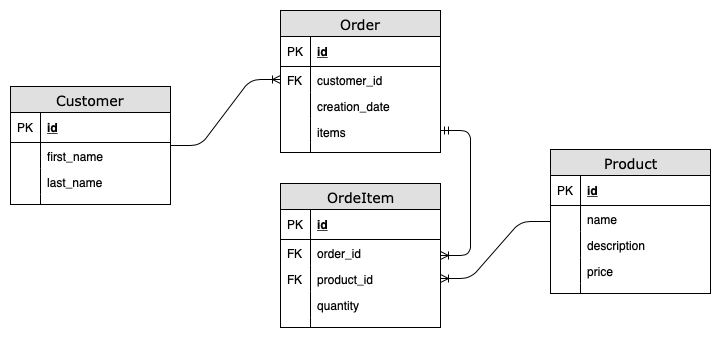

# Migrando a aplicação para versões novas de frameworks

Faz muito tempo que não mexo nessa aplicação. Como não existe nenhuma documentação e nem testes pra me guiar no processo de migração para novas versões eu estou pensando em fazer me guiando pelos seguintes passos:

1. Entrar em cada arquivo JS e listar as funções e funcionalidades da aplicação ✅
2. Desenhar um modelo de dados que represente os dados da aplicação ✅
3. Desenhar as telas e as iterações (TODO)
4. Migrar o backend de JEE para Spring Boot
5. Jogar fora todo o frontend e reescrevê-lo na nova versão do ember

## Frontend

### CSS

A aplicação utiliza como base o template de CSS do Foundation e os estilos específicos estão definidos no arquivo *app.css*

### Imagens

Contém apenas 4 ícones que indicam os estado de: error, worn, info, ok

### HTML

É o HTML5 bloilerplate criado automaticamente pelo ember

### JavaScript

* /core.js : carrega toda app e contém as seguinte funções genéricas
  * fn generateGuid : para gerar um UUID
  * fn Handlebar 'money' : Função auxiliar para formatar input de valores monetário no formato $0.00
* /templates/ : modelos das páginas do App usando templates Handlebars
  * index.hbs
  * application.hbs
  * nav.hbs
  * customers.hbs
  * customer.hbs
  * _customer_selector.hbs
  * products.hbs
  * product.hbs
  * _product_selector.hbs
  * orders.hbs
  * order.hbs
* /store.js : Utiliza o RESTAdapter do EmberData que mapea o resultado dos dados do serviço REST no backend em Java para Modelos do App usando funções de tradução das properties e também properties complexas e composição.
* /router.js : Faz o routing transformando as URLs nas páginas da aplicação que precisam ser exibidas e chamando o *store.js* conforme dados solicitados.  
* /controlers/
  * ajax-loading.js : Intercepta requisições ajax, exibindo mensagens de erro ou sucesso, conforme respostas enviadas pelo serviço REST em Java.
  * application.js : Contém os controller centrais da applicação
    * App.MessagesController : Sabe como receber e exibir as mensagens da aplicação
    * App.TransactionalController : Centraliza as transações e controle do estado de objetos Locais x Server (TODO: Verificar se necessário nas novas versões do Ember).
  * customer.js : Controle do Model de Clientes
  * product.js : Controle do Model de Produtos
  * order.js : Controle do Model de Pedidos => ( Clientes x Produtos )
* /controlers/
  * application.js : Contém componentes customizados da View da aplicação
    * App.TextField : Evita enviar formulário por engano em caso de apertar **Enter** em algum campo de texto tela.
    * App.IdField : Campo com o Id do Banco de Dados que não é editável
    * App.IntegerField : Campo que evita digitar caracteres que não são números inteiros
    * App.MoneyField : Representa um campo em formato monetário.

## Model de Dados



O modelo está representado na forma de entidade relacionamento mas como será migrado para o MongoDB a representação abaixo em JSON é melhor já que o pedido pode ser uma coleção que contém um array com vários itens de produtos.

```JavaScript
customer = {
  id : 123,
  first_name : "John",
  last_name : "Doe"
}

product1 = {
  id : 1,
  name : "Duke",
  description : "Duke, the Java Mascot",
  price : 3.1415
}

product2 = {
  id : 2,
  name : "Tomster",
  description : "Tomster, the Ember Mascot",
  price : 3.14159265359
}

order = {
  id : 20,
  customer_id : 123,
  creation_date : '2018-03-08T08:15:16.097Z',
  items : [ 
    { product_id : 1,
      quantity : 2
    },
    { product_id : 2,
      quantity : 5
    },
  ]
}

```